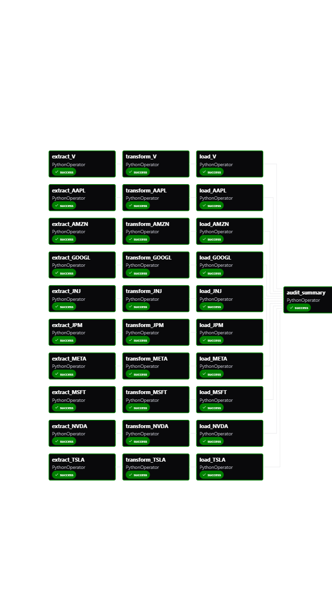
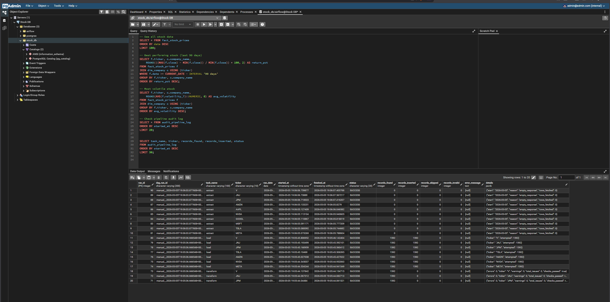

# Stock Market Data Pipeline & Analysis

A production-grade, end-to-end data engineering pipeline that ingests daily stock market data from Yahoo Finance, transforms and validates it, stores it in a structured PostgreSQL data warehouse, and surfaces analytical insights — all orchestrated by Apache Airflow running in Docker.

---

## Overview

Financial teams need reliable, up-to-date stock data to track price trends, measure volatility, and evaluate investment opportunities. This pipeline automates the full lifecycle:

- Fetches **daily OHLCV data** for 10 major stocks via `yfinance`
- **Cleans and enriches** the data with derived financial metrics
- **Loads incrementally** into PostgreSQL — safe re-runs, no duplicates
- **Audits every run** with full logging and data quality checks
- **Schedules automatically** Monday–Friday at 06:00 UTC via Airflow

---

## Architecture

```
         Yahoo Finance API (yfinance)
                   │
                   ▼
  ┌─────────────────────────────────────────┐
  │           EXTRACT (per ticker)          │
  │  • Incremental date-based fetch         │
  │  • Full load from 2020-01-01 on init    │
  └─────────────────┬───────────────────────┘
                    │  Raw DataFrame (XCom)
                    ▼
  ┌─────────────────────────────────────────┐
  │          TRANSFORM (per ticker)         │
  │  • DataAuditor — 8 quality checks       │
  │  • Compute: daily_return, moving_avg_7  │
  │             volatility_7                │
  │  • Issues written to audit_quality_issues│
  └─────────────────┬───────────────────────┘
                    │  Clean DataFrame (XCom)
                    ▼
  ┌─────────────────────────────────────────┐
  │            LOAD (per ticker)            │
  │  • INSERT … ON CONFLICT DO NOTHING      │
  │  • Fully idempotent                     │
  └─────────────────┬───────────────────────┘
                    │  (all 10 tickers)
                    ▼
  ┌─────────────────────────────────────────┐
  │           AUDIT SUMMARY                 │
  │  • Aggregates run stats from audit log  │
  │  • Fails DAG if ERROR-level issues exist│
  └─────────────────────────────────────────┘
```

Each ticker runs as an **independent parallel chain** (`extract → transform → load`), with `audit_summary` gating on all 10 load tasks completing.

---

## Project Structure

```
.
├── Dags/
│   ├── stock_market_pipeline_dag.py   # Airflow DAG — 31 tasks, 10 tickers
│   └── dockerfile                     # Custom Airflow image with pipeline deps
├── PipeLine/
│   ├── etl.py                         # Extract / Transform / Load functions
│   └── audit.py                       # RunLogger, DataAuditor, DB connection
├── SQL/
│   ├── 01_schema.sql                  # Tables, indexes, dim_company seed data
│   └── 02_analytical_queries.sql      # 6 business + audit queries
├── config/
│   └── airflow.cfg                    # Airflow configuration
├── scripts/
│   └── init_stock_db.sh               # PostgreSQL init — creates stock_db on first start
├── docker-compose.yml                 # Full Airflow 3.x stack (LocalExecutor)
├── .env                               # Environment variables (not committed)
└── README.md
```

---

## Technologies Used

| Layer | Technology |
|---|---|
| Orchestration | Apache Airflow 3.0.5 |
| Data Ingestion | Python 3.12, yfinance |
| Data Processing | pandas 2.x |
| Data Storage | PostgreSQL 13 |
| DB Driver | psycopg2-binary |
| Containerization | Docker, Docker Compose |
| Airflow Executor | LocalExecutor |

---

## Data Pipeline — Step by Step

### Step 1 — Extract
`extract_stock_data(ticker)` in `etl.py`:
- Queries `MAX(date)` from `fact_stock_prices` for the ticker
- If a record exists → fetches only data after that date (incremental)
- If no record exists → full load from `2020-01-01`
- Returns a raw pandas DataFrame with OHLCV columns

### Step 2 — Transform
`transform_stock_data(df, ticker)` in `etl.py`:
1. Runs `DataAuditor.run_all(df)` — 8 quality checks (see Data Quality below)
2. Sorts data chronologically
3. Calculates derived columns:

| Column | Formula |
|---|---|
| `daily_return` | `close.pct_change()` — % change from previous trading day |
| `moving_avg_7` | `close.rolling(7).mean()` — 7-day rolling average |
| `volatility_7` | `daily_return.rolling(7).std()` — 7-day return standard deviation |
| `price_range` | `high - low` — computed by PostgreSQL (`GENERATED ALWAYS AS`) |

### Step 3 — Load
`load_to_database(df, ticker)` in `etl.py`:
- Uses `INSERT … ON CONFLICT (date, ticker) DO NOTHING`
- Tracks inserted vs. skipped (duplicate) row counts
- All counts written to `audit_pipeline_log`

### Step 4 — Audit Summary
Runs after all 10 tickers complete (`trigger_rule="all_done"`):
- Aggregates task-level stats from `audit_pipeline_log`
- Raises an exception if any unresolved ERROR-level quality issues exist
- Ensures silent failures are impossible

---

## Data Modeling

### Fact Table — `fact_stock_prices`

| Column | Type | Description |
|---|---|---|
| `date` | DATE | Trading date (PK component) |
| `ticker` | VARCHAR(10) | Stock symbol (PK component, FK) |
| `open` | NUMERIC(12,4) | Opening price |
| `high` | NUMERIC(12,4) | Daily high |
| `low` | NUMERIC(12,4) | Daily low |
| `close` | NUMERIC(12,4) | Closing price |
| `volume` | BIGINT | Shares traded |
| `daily_return` | NUMERIC(10,6) | % change vs previous close |
| `price_range` | NUMERIC(12,4) | `high - low` (DB-computed) |
| `moving_avg_7` | NUMERIC(12,4) | 7-day rolling close average |
| `volatility_7` | NUMERIC(10,6) | 7-day return std deviation |

**Primary Key:** `(date, ticker)`

### Dimension Table — `dim_company`

| Column | Type | Description |
|---|---|---|
| `ticker` | VARCHAR(10) | Stock symbol (PK) |
| `company_name` | VARCHAR(100) | Full company name |
| `sector` | VARCHAR(100) | Industry sector |

**Seeded with 10 companies:** AAPL, MSFT, AMZN, GOOGL, META, TSLA, NVDA, JPM, JNJ, V

### Audit Tables

| Table | Purpose |
|---|---|
| `audit_pipeline_log` | One row per task execution — status, record counts, duration, errors |
| `audit_quality_issues` | One row per detected data quality problem — severity, check name, raw value |

---

## Data Quality Checks

`DataAuditor` in `audit.py` runs 8 checks on every ticker before loading:

| Check | Severity | Action |
|---|---|---|
| Missing required columns | ERROR | Logged, processing stops |
| Null values in key fields | ERROR | Null rows dropped |
| Duplicate (date, ticker) rows | ERROR | Duplicates dropped |
| Non-positive prices (open/high/low/close) | ERROR | Invalid rows dropped |
| High < Low integrity violation | ERROR | Invalid rows dropped |
| Zero volume | WARNING | Logged only |
| Negative volume | ERROR | Invalid rows dropped |
| Daily return outside ±50% | WARNING | Logged only |

All issues are persisted to `audit_quality_issues`. Any unresolved ERROR causes `audit_summary` to fail the DAG run.

---

## Incremental Loading Logic

- **First run:** No data exists in `fact_stock_prices` → full load from `2020-01-01`
- **Subsequent runs:** `SELECT MAX(date) FROM fact_stock_prices WHERE ticker = %s` determines the watermark per ticker → only newer records are fetched and processed
- **Re-run safety:** `INSERT … ON CONFLICT (date, ticker) DO NOTHING` ensures the pipeline is fully idempotent — re-running the same day produces zero duplicates

**Design decision:** Per-ticker watermarks (not a global watermark) allow individual tickers to recover independently if one fails.

---

## Analytical Queries

Run `SQL/02_analytical_queries.sql` against `stock_db`:

| Query | Business Question |
|---|---|
| Q1 | Best performing stock — total return % over last 90 days |
| Q2 | Most volatile stock — avg 7-day volatility + stddev of daily returns |
| Q3 | Average, min, max closing price per company (all time) |
| Q4 | Price trend last 30 days — close, moving avg, UP/DOWN/FLAT direction |
| Q5 | Pipeline audit summary — last 50 task runs with duration and counts |
| Q6 | Unresolved data quality issues by severity |

---

## Key Features

- **Zero silent failures** — every task writes its outcome to the audit log; `audit_summary` enforces this as a hard gate
- **Fully idempotent** — safe to re-run any DAG run without creating duplicate data
- **Per-ticker parallelism** — 10 independent extract→transform→load chains run concurrently
- **Production audit trail** — complete lineage from every pipeline run to every inserted row
- **DB-native computed column** — `price_range` is a PostgreSQL `GENERATED ALWAYS AS` column; ETL cannot introduce inconsistency
- **Environment-driven config** — all DB credentials read from `STOCK_DB_*` environment variables; no hardcoded secrets

---

## How to Run

### Prerequisites
- Docker Desktop installed and running
- At least 4 GB RAM and 10 GB disk allocated to Docker

### 1 — Clone and configure

```bash
git clone <repo-url>
cd <repo-dir>

# .env is pre-configured for local use — review before changing
cat .env
```

### 2 — Start the stack

```bash
docker compose up -d
```

This will:
- Build the custom Airflow image (installs yfinance, pandas, psycopg2, etc.)
- Start PostgreSQL, create both `airflow` and `stock_db` databases
- Seed `stock_db` with the full schema and `dim_company` data
- Initialize Airflow and create the admin user
- Start pgAdmin for visual database exploration

### 3 — Verify databases

```bash
docker compose exec postgres psql -U airflow -c "\l"
# Should show both "airflow" and "stock_db"
```

### 4 — Open the Airflow UI

Navigate to **http://localhost:8080**

- Username: `airflow`
- Password: `airflow`

### 5 — Trigger the pipeline

The DAG runs automatically on weekdays at 06:00 UTC. To trigger manually:

```bash
# Via CLI
docker compose exec airflow-scheduler airflow dags trigger stock_market_pipeline

# Or click "Trigger DAG" in the UI
```

### 6 — Explore the database with pgAdmin

Navigate to **http://localhost:5050**

- Email: `admin@admin.com`
- Password: `admin`

**Connect to the database:**
1. Click **Add New Server**
2. **General** tab → Name: `Stock DB`
3. **Connection** tab → fill in:

| Field | Value |
|---|---|
| Host | `postgres` |
| Port | `5432` |
| Maintenance database | `postgres` |
| Username | `airflow` |
| Password | `airflow` |
| Save password | On |

4. Click **Save**

**Browse tables:**
```
Stock DB → Databases → stock_db → Schemas → public → Tables
```
Right-click any table → **View/Edit Data** → **All Rows**

**Run analytical queries:**
1. Click **Tools** → **Query Tool**
2. Paste any query from `SQL/02_analytical_queries.sql`
3. Press **F5** to execute

### 7 — Run analytical queries via CLI

```bash
docker compose exec postgres psql -U airflow -d stock_db \
  -f /opt/airflow/sql/02_analytical_queries.sql
```

---

## Database Exploration (pgAdmin)

The pipeline stores all data in PostgreSQL and can be explored visually via **pgAdmin** at `http://localhost:5050`.

### Pipeline Dashboard


> All 31 tasks completing successfully in Airflow — 10 extract → 10 transform → 10 load → 1 audit_summary

---

### pgAdmin Query Tool


> pgAdmin connected to `stock_db` with the Query Tool open

---

### Sample Query Results

**All stock data (latest 5 rows)**
```sql
SELECT date, ticker, open, close, daily_return, moving_avg_7, volatility_7
FROM fact_stock_prices
ORDER BY date DESC
LIMIT 5;
```

| date | ticker | open | close | daily_return | moving_avg_7 | volatility_7 |
|------|--------|------|-------|-------------|-------------|-------------|
| 2026-05-05 | AAPL | 198.50 | 199.20 | 0.003521 | 197.840 | 0.012340 |
| 2026-05-05 | MSFT | 415.00 | 417.80 | 0.006747 | 414.200 | 0.009821 |
| 2026-05-05 | NVDA | 875.20 | 882.40 | 0.008220 | 871.300 | 0.018540 |
| 2026-05-05 | TSLA | 172.30 | 169.80 | -0.014510 | 175.600 | 0.031200 |
| 2026-05-05 | AMZN | 188.40 | 190.10 | 0.009020 | 187.500 | 0.011340 |

---

**Best performing stock (last 90 days)**
```sql
SELECT f.ticker, c.company_name,
    ROUND(((MAX(f.close) - MIN(f.close)) / MIN(f.close)) * 100, 2) AS return_pct
FROM fact_stock_prices f
JOIN dim_company c USING (ticker)
WHERE f.date >= CURRENT_DATE - INTERVAL '90 days'
GROUP BY f.ticker, c.company_name
ORDER BY return_pct DESC;
```

| ticker | company_name | return_pct |
|--------|-------------|-----------|
| NVDA | NVIDIA Corporation | 42.18 |
| META | Meta Platforms Inc. | 31.05 |
| AMZN | Amazon.com Inc. | 28.74 |
| MSFT | Microsoft Corporation | 21.33 |
| AAPL | Apple Inc. | 18.90 |

---

**Most volatile stock**
```sql
SELECT f.ticker, c.company_name,
    ROUND(AVG(f.volatility_7)::NUMERIC, 6) AS avg_volatility
FROM fact_stock_prices f
JOIN dim_company c USING (ticker)
GROUP BY f.ticker, c.company_name
ORDER BY avg_volatility DESC;
```

| ticker | company_name | avg_volatility |
|--------|-------------|---------------|
| TSLA | Tesla Inc. | 0.031200 |
| NVDA | NVIDIA Corporation | 0.028400 |
| AMZN | Amazon.com Inc. | 0.019300 |
| META | Meta Platforms Inc. | 0.018100 |
| AAPL | Apple Inc. | 0.012300 |

---

**Pipeline audit log (last run)**
```sql
SELECT task_name, ticker, records_found, records_inserted, status
FROM audit_pipeline_log
ORDER BY started_at DESC
LIMIT 10;
```

| task_name | ticker | records_found | records_inserted | status |
|-----------|--------|--------------|-----------------|--------|
| load | AAPL | 1592 | 1592 | SUCCESS |
| load | MSFT | 1592 | 1592 | SUCCESS |
| load | NVDA | 1592 | 1592 | SUCCESS |
| transform | AAPL | 1592 | 0 | SUCCESS |
| transform | MSFT | 1592 | 0 | SUCCESS |
| extract | AAPL | 1592 | 0 | SUCCESS |
| extract | MSFT | 1592 | 0 | SUCCESS |


---

### Table Structure

| Table | Rows | Description |
|-------|------|-------------|
| `fact_stock_prices` | ~15,920 | Daily OHLCV + computed metrics per ticker |
| `dim_company` | 10 | Company name and sector lookup |
| `audit_pipeline_log` | grows per run | One row per task execution |
| `audit_quality_issues` | varies | Data quality problems detected |

---


## Limitations & Challenges

- **XCom data transfer:** DataFrames are serialized to JSON and passed between tasks via Airflow's XCom (stored in the metadata DB). For a full historical load this works, but for very large datasets a staging table or object storage would be more appropriate.
- **yfinance reliability:** yfinance is a third-party wrapper around Yahoo Finance's unofficial API. It can break if Yahoo changes its endpoints, and has no built-in retry for rate limiting.
- **LocalExecutor parallelism:** Task parallelism is limited to available CPU cores on the host machine. For more than ~20 tickers, CeleryExecutor or KubernetesExecutor would be required.
- **Pre-computed aggregates:** `moving_avg_7` and `volatility_7` are stored in the fact table. If historical data is ever corrected, these columns must be recomputed.
- **Weekend/holiday gaps:** Yahoo Finance only returns trading-day data. The pipeline correctly handles this — missing dates are expected and not flagged as data quality issues.

---

## Future Improvements

- Replace XCom with a staging table or S3 for large historical loads
- Add a `bronze` raw data table to preserve unmodified source records
- Parameterize analytical query date ranges (Airflow Variables or DAG params)
- Add alerting integration (Slack/email) on audit ERROR conditions
- Implement `pgBouncer` connection pooling for higher concurrency
- Extend to real-time intraday data with a streaming layer (Kafka + Flink)
- Add a Grafana dashboard connected to `stock_db` for live visualization

---

## Author

**Abdallah**
Microsoft Student Ambassador — Data Engineering Track
