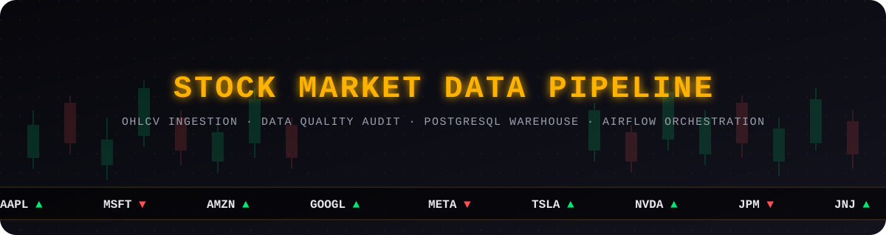

<div align="center">



**Ten tickers. Thirty-one tasks. Zero silent failures — a warehouse that audits every row it writes.**


<br>

[**Overview**](#-overview) · [**Architecture**](#-architecture) · [**Orchestration**](#-the-orchestration-layer) · [**Data Quality**](#-the-data-quality-engine) · [**Run It**](#-getting-started) · [**Author**](#-author)

</div>

<br>

> **On project status.** This pipeline was fully built, deployed, and run on its production schedule during development — the screenshots in [Database Exploration](#-database-exploration-pgadmin) are from a real, successful run, not a mockup. It has since been decommissioned as an always-on service and now lives here as a complete, reproducible reference implementation. Clone it and follow [Getting Started](#-getting-started) to bring it back up locally in a few minutes.

<br>

<div align="center">

### 📌 By the Numbers

| 10 | 31 | 8 | 100% | ~15,920 | 6 |
|:---:|:---:|:---:|:---:|:---:|:---:|
| tickers tracked | Airflow tasks per run | automated quality checks | task success rate, last run | rows warehoused | analytical SQL queries |

</div>


## 📍 Overview

Free financial data APIs are convenient and quietly unreliable — endpoints shift, rate limits bite, and a bad row can slip into a warehouse without anyone noticing until a dashboard number looks wrong weeks later. This project exists to close that gap.

**Stock Market Data Pipeline** takes daily OHLCV data for 10 major tickers and puts it through a real orchestrated pipeline — incremental extraction, automated quality auditing, idempotent loading, and business-facing analytical queries — scheduled and run the way a production data engineering team would actually run it, not simulated in a notebook.

Two things had to be true for that to hold up:

> 🛡️ **Nothing fails silently.** Every task, for every ticker, on every run, writes its outcome to an audit log. If a data quality check finds an unresolved error, the DAG itself fails — loudly, on purpose.
>
> 🔁 **Every run is safe to repeat.** Re-triggering the same day, or recovering a single failed ticker, never produces a duplicate row. The pipeline was designed to be re-run, not just run.


## 🧭 Architecture

```
       Yahoo Finance API (yfinance)
                 │
                 ▼
┌─────────────────────────────────────────┐
│           EXTRACT (per ticker)          │
│  • Incremental date-based fetch         │
│  • Full load from 2020-01-01 on init    │
└─────────────────┬───────────────────────┘
                  │  Raw DataFrame (XCom)
                  ▼
┌─────────────────────────────────────────┐
│          TRANSFORM (per ticker)         │
│  • DataAuditor — 8 quality checks       │
│  • Compute: daily_return, moving_avg_7  │
│             volatility_7                │
│  • Issues written to audit_quality_issues│
└─────────────────┬───────────────────────┘
                  │  Clean DataFrame (XCom)
                  ▼
┌─────────────────────────────────────────┐
│            LOAD (per ticker)            │
│  • INSERT … ON CONFLICT DO NOTHING      │
│  • Fully idempotent                     │
└─────────────────┬───────────────────────┘
                  │  (all 10 tickers)
                  ▼
┌─────────────────────────────────────────┐
│           AUDIT SUMMARY                 │
│  • Aggregates run stats from audit log  │
│  • Fails DAG if ERROR-level issues exist│
└─────────────────────────────────────────┘
```

Each ticker runs as an **independent parallel chain** (`extract → transform → load`), with `audit_summary` gating on all 10 load tasks completing (`trigger_rule="all_done"`).


## ⚙️ The Orchestration Layer

The DAG (`Dags/stock_market_pipeline_dag.py`) is not one linear script — it's **31 independent Airflow tasks**: 10 extract, 10 transform, 10 load, and one audit gate, running as 10 parallel per-ticker chains rather than one big sequential job.

<details open>
<summary><b>Why per-ticker chains instead of one monolithic task</b></summary>
<br>

If a single task pulled and processed all 10 tickers together, one bad API response for one ticker would stall the other nine. Splitting the DAG into independent chains means a failure in `TSLA`'s extract task doesn't block `AAPL`, `MSFT`, or any other ticker from completing — each one succeeds, fails, and retries on its own.

</details>

<div align="center">

<br>
<em>All 31 tasks completing successfully — 10 extract → 10 transform → 10 load → 1 audit_summary</em>
</div>


## 🛡️ The Data Quality Engine

`DataAuditor` (`PipeLine/audit.py`) runs **8 checks on every ticker, before a single row is loaded**:

| Check | Severity | Action |
|---|:---:|---|
| Missing required columns | ERROR | Logged, processing stops |
| Null values in key fields | ERROR | Null rows dropped |
| Duplicate `(date, ticker)` rows | ERROR | Duplicates dropped |
| Non-positive prices (open/high/low/close) | ERROR | Invalid rows dropped |
| `high < low` integrity violation | ERROR | Invalid rows dropped |
| Zero volume | WARNING | Logged only |
| Negative volume | ERROR | Invalid rows dropped |
| Daily return outside ±50% | WARNING | Logged only |

Every issue — resolved or not — is persisted to `audit_quality_issues` with its severity and the raw offending value. The `audit_summary` task then aggregates every ticker's outcome and **fails the entire DAG run** if any unresolved `ERROR`-level issue exists.

> 🔬 **Engineering note.** The gate is intentionally strict: a `WARNING` (zero volume, an extreme daily return) is logged and the run proceeds — those can be legitimate market behavior. An `ERROR` (negative volume, `high < low`) means the data itself is broken, and the DAG is designed to stop rather than quietly warehouse it.


## 🔁 Incremental Loading & Idempotency

- **First run:** no data exists in `fact_stock_prices` → full load from `2020-01-01`
- **Every run after:** `SELECT MAX(date) FROM fact_stock_prices WHERE ticker = %s` gives a **per-ticker watermark** → only newer records are fetched and processed
- **Re-run safety:** `INSERT … ON CONFLICT (date, ticker) DO NOTHING` makes the whole pipeline idempotent — re-running the same day inserts zero duplicates

> 🔬 **Engineering note.** The watermark is tracked *per ticker*, not globally, on purpose. A global "last successful run" watermark would mean one failed ticker holds back the other nine on the next run. Per-ticker watermarks let each stock recover independently — exactly the same reasoning behind splitting the DAG into per-ticker chains above.


## 🛠️ Tech Stack

| Layer | Technology |
|---|---|
| Orchestration | Apache Airflow 3.0.5 (LocalExecutor) |
| Data Ingestion | Python 3.12, yfinance |
| Data Processing | pandas 2.x |
| Data Storage | PostgreSQL 13 |
| DB Driver | psycopg2-binary |
| Containerization | Docker, Docker Compose |
| Database Exploration | pgAdmin |


## 📂 Project Structure

```
.
├── Assets/
│   ├── stock_readme_header.svg        # Animated README header (glowing title + ticker tape)
│   ├── stock_readme_divider.svg       # Animated README section divider
│   └── stock_readme_footer.svg        # README footer / signature banner
├── Dags/
│   ├── stock_market_pipeline_dag.py   # Airflow DAG — 31 tasks, 10 tickers
│   └── dockerfile                     # Custom Airflow image with pipeline deps
├── PipeLine/
│   ├── etl.py                         # Extract / Transform / Load functions
│   └── audit.py                       # RunLogger, DataAuditor, DB connection
├── SQL/
│   ├── 01_schema.sql                  # Tables, indexes, dim_company seed data
│   └── 02_analytical_queries.sql      # 6 business + audit queries
├── config/
│   └── airflow.cfg                    # Airflow configuration
├── scripts/
│   └── init_stock_db.sh               # PostgreSQL init — creates stock_db on first start
├── screenshots/                       # Airflow + pgAdmin captures used in this README
├── docker-compose.yml                 # Full Airflow 3.x stack (LocalExecutor)
├── .env.example                       # Template for local environment variables
└── README.md
```


## 🗄️ Data Modeling

### Fact Table — `fact_stock_prices`

| Column | Type | Description |
|---|---|---|
| `date` | DATE | Trading date (PK component) |
| `ticker` | VARCHAR(10) | Stock symbol (PK component, FK) |
| `open` / `high` / `low` / `close` | NUMERIC(12,4) | OHLC prices |
| `volume` | BIGINT | Shares traded |
| `daily_return` | NUMERIC(10,6) | % change vs previous close |
| `price_range` | NUMERIC(12,4) | `high - low` — **DB-computed**, `GENERATED ALWAYS AS` |
| `moving_avg_7` | NUMERIC(12,4) | 7-day rolling close average |
| `volatility_7` | NUMERIC(10,6) | 7-day return standard deviation |

**Primary key:** `(date, ticker)`

### Dimension Table — `dim_company`

`ticker` (PK), `company_name`, `sector` — seeded with all 10 tracked companies.

### Audit Tables

| Table | Purpose |
|---|---|
| `audit_pipeline_log` | One row per task execution — status, record counts, duration, errors |
| `audit_quality_issues` | One row per detected data quality problem — severity, check name, raw value |


## 📊 Analytical Queries

Run `SQL/02_analytical_queries.sql` against `stock_db`:

| Query | Business Question |
|---|---|
| Q1 | Best performing stock — total return % over last 90 days |
| Q2 | Most volatile stock — avg 7-day volatility + stddev of daily returns |
| Q3 | Average, min, max closing price per company (all time) |
| Q4 | Price trend last 30 days — close, moving avg, UP/DOWN/FLAT direction |
| Q5 | Pipeline audit summary — last 50 task runs with duration and counts |
| Q6 | Unresolved data quality issues by severity |


## 🚀 Getting Started

<details>
<summary><b>Prerequisites</b></summary>
<br>

- Docker Desktop installed and running
- At least 4 GB RAM and 10 GB disk allocated to Docker

</details>

<details open>
<summary><b>1 — Clone and configure</b></summary>
<br>

```bash
git clone https://github.com/abdallah-farahat/Stock-Market-Data-Pipeline-Analysis.git
cd Stock-Market-Data-Pipeline-Analysis

# copy the template and fill in local values — never commit your real .env
cp .env.example .env
```

</details>

<details open>
<summary><b>2 — Start the stack</b></summary>
<br>

```bash
docker compose up -d
```

This builds the custom Airflow image, starts PostgreSQL (creating both `airflow` and `stock_db`), seeds `stock_db` with the schema and `dim_company` data, initializes Airflow, and starts pgAdmin.

</details>

<details>
<summary><b>3 — Verify databases</b></summary>
<br>

```bash
docker compose exec postgres psql -U airflow -c "\l"
# Should show both "airflow" and "stock_db"
```

</details>

<details open>
<summary><b>4 — Open the Airflow UI</b></summary>
<br>

**http://localhost:8080** — Username: `airflow` · Password: `airflow`

</details>

<details open>
<summary><b>5 — Trigger the pipeline</b></summary>
<br>

The DAG is configured to run weekdays at 06:00 UTC. To trigger manually:

```bash
docker compose exec airflow-scheduler airflow dags trigger stock_market_pipeline
# or click "Trigger DAG" in the UI
```

</details>

<details>
<summary><b>6 — Explore with pgAdmin</b></summary>
<br>

**http://localhost:5050** — Email: `admin@admin.com` · Password: `admin`

Add New Server → name it `Stock DB` → Connection tab:

| Field | Value |
|---|---|
| Host | `postgres` |
| Port | `5432` |
| Maintenance database | `postgres` |
| Username / Password | `airflow` / `airflow` |

Then: `Stock DB → Databases → stock_db → Schemas → public → Tables`, or **Tools → Query Tool** to run `SQL/02_analytical_queries.sql` directly.

</details>

<details>
<summary><b>7 — Run analytical queries via CLI</b></summary>
<br>

```bash
docker compose exec postgres psql -U airflow -d stock_db \
  -f /opt/airflow/sql/02_analytical_queries.sql
```

</details>


## 🖥️ Database Exploration (pgAdmin)

<div align="center">

<br>
<em>pgAdmin connected to <code>stock_db</code> with the Query Tool open</em>
</div>

<br>

<details>
<summary><b>Sample query outputs</b> (example data from a full-history run)</summary>
<br>

**Best performing stock (last 90 days)**

```sql
Select f.ticker, c.company_name,
    Round(((Max(f.close) - Min(f.close)) / Min(f.close)) * 100, 2) As return_pct
From fact_stock_prices f
Join dim_company c Using (ticker)
Where f.date >= Current_Date - Interval '90 days'
Group By f.ticker, c.company_name
Order By return_pct Desc;
```

| ticker | company_name | return_pct |
|---|---|---|
| NVDA | NVIDIA Corporation | 42.18 |
| META | Meta Platforms Inc. | 31.05 |
| AMZN | Amazon.com Inc. | 28.74 |
| MSFT | Microsoft Corporation | 21.33 |
| AAPL | Apple Inc. | 18.90 |

**Pipeline audit log (last run)**

```sql
Select task_name, ticker, records_found, records_inserted, status
From audit_pipeline_log
Order By started_at Desc
Limit 10;
```

| task_name | ticker | records_found | records_inserted | status |
|---|---|---|---|---|
| load | AAPL | 1592 | 1592 | SUCCESS |
| load | MSFT | 1592 | 1592 | SUCCESS |
| load | NVDA | 1592 | 1592 | SUCCESS |
| transform | AAPL | 1592 | 0 | SUCCESS |
| extract | AAPL | 1592 | 0 | SUCCESS |

</details>

<br>

| Table | Rows | Description |
|---|---|---|
| `fact_stock_prices` | ~15,920 | Daily OHLCV + computed metrics per ticker |
| `dim_company` | 10 | Company name and sector lookup |
| `audit_pipeline_log` | grows per run | One row per task execution |
| `audit_quality_issues` | varies | Data quality problems detected |


## ⚠️ Limitations & Challenges

- **XCom data transfer:** DataFrames are serialized to JSON and passed between tasks via Airflow's XCom. It works for this scale; a staging table or object storage would replace it for much larger historical loads.
- **yfinance reliability:** an unofficial wrapper around Yahoo Finance — it can break on endpoint changes and has no built-in retry for rate limiting.
- **LocalExecutor parallelism:** bounded by host CPU cores. Beyond ~20 tickers, CeleryExecutor or KubernetesExecutor would be needed.
- **Pre-computed aggregates:** `moving_avg_7` and `volatility_7` are stored, not recomputed on read — a historical data correction would need to recompute them.
- **Weekend/holiday gaps:** Yahoo Finance only returns trading-day data; missing dates are expected, not flagged as quality issues.


## 🗺️ Roadmap

- [ ] Replace XCom with a staging table or object storage for large historical loads
- [ ] Add a `bronze` raw data table to preserve unmodified source records
- [ ] Parameterize analytical query date ranges (Airflow Variables or DAG params)
- [ ] Add alerting integration (Slack/email) on audit `ERROR` conditions
- [ ] `pgBouncer` connection pooling for higher concurrency
- [ ] Extend to real-time intraday data with a streaming layer (Kafka + Flink)
- [ ] Grafana dashboard connected to `stock_db` for live visualization


## 👤 Author

<div align="center">


[](https://www.linkedin.com/in/abdallah-ali-da/)
[](https://github.com/abdallah-farahat)
[](mailto:abdofarahat2006@gmail.com)

</div>
